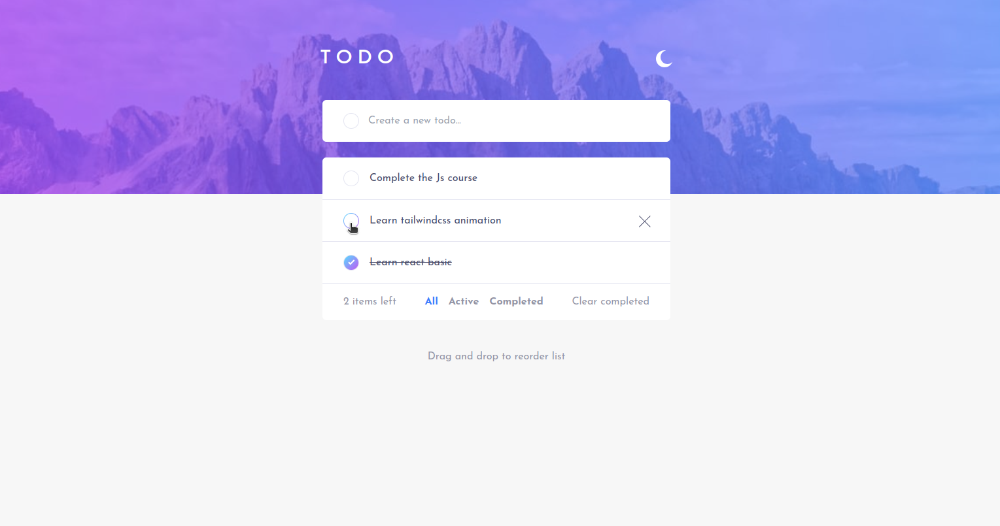
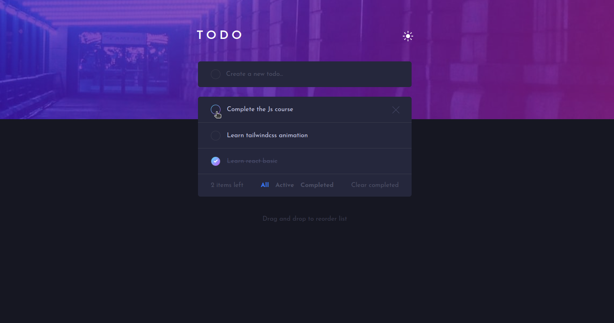

# Frontend Mentor - Todo app solution

This is a solution to the [Todo app challenge on Frontend Mentor](https://www.frontendmentor.io/challenges/todo-app-Su1_KokOW).
## Table of contents

- [Overview](#overview)
  - [The challenge](#the-challenge)
  - [Screenshot](#screenshot)
  - [Links](#links)
- [My process](#my-process)
  - [Built with](#built-with)
  - [What I learned](#what-i-learned)
  - [Continued development](#continued-development)
  - [Useful resources](#useful-resources)
- [Author](#author)
- [Acknowledgments](#acknowledgments)

## Overview

### The challenge

Users should be able to:

- View the optimal layout for the app depending on their device's screen size
- See hover states for all interactive elements on the page
- Add new todos to the list
- Mark todos as complete
- Delete todos from the list
- Filter by all/active/complete todos
- Clear all completed todos
- Toggle light and dark mode
- Drag and drop to reorder items on the list

### Screenshot

### Links

- Solution URL: [repository](https://github.com/Jhonatan-Cortezz/todo-react)
- Live Site URL: [todo-react-jhonatan-cortez](https://todo-react-jhonatan-cortez.vercel.app/)

## My process

### Built with

- Semantic HTML5 markup
- Tailwindcss
- [React](https://reactjs.org/) - JS library

### Continued development
- React componets
- Props
- Hooks

### Useful resources

- [@hello-pangea/dnd](https://github.com/hello-pangea/dnd) - This helped me drag and drop functionality.
- [React Js guide](https://bluuweb.dev/05-react/) - This guide I use for learning basic concepts of React.

## Author

- Github profile - [Jhonatan Alexander Cortez](https://github.com/Jhonatan-Cortezz)
- Frontend Mentor - [@yourusername](https://www.frontendmentor.io/profile/Jhonatan-Cortezz)

## Acknowledgments
I appreciate [Bluuweb](https://twitter.com/bluuweb) for the knowledge shared
